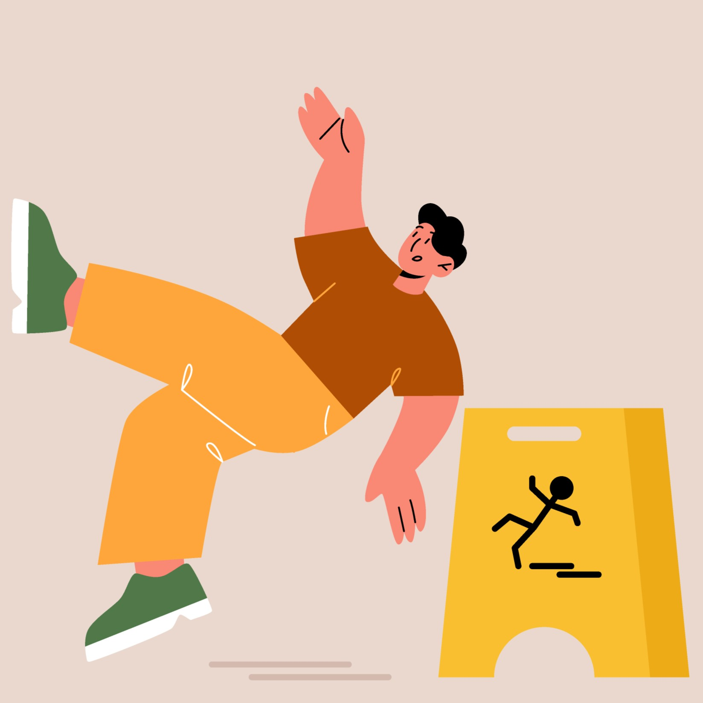

# 🕵️‍♀️ Juego del ahorcado 🕵️‍♀️

## Herramientas Usadas


## Correr localmente

Clonar el proyecto

```bash
  git clone https://github.com/LauraMamian/Challenge-Oracle-ONE-Juego-ahorcado.git
```

Ir al directorio del proyecto

```bash
  cd my-project
```

Puedes usar extensiones de **Visual Studio Code** como `Live Server` para correr fácilmente el proyecto.

## 📖 Descripción 

Este proyecto consiste adivinar una palabra antes de que se complete la imagen a los **5 intentos**.

<p align="center">

</p>

## 📝 Requisitos 

1. Debe funcionar solo con letras mayúsculas.
2. No deben ser utilizadas letras con acentos ni caracteres especiales.
3. Al completar el número de intentos, debe ser mostrado un mensaje  ***"Fin del juego"*** en la pantalla.
4. Si se completa la palabra correcta antes de que se acaben los intentos, debe ser mostrado un mensaje de ***"Ganaste, ¡Felicidades!"*** en la pantalla.
5. La página debe tener los guiones indicando cada letra de la palabra, separados por un espacio.
6. Para comenzar el juego la página debe tener un botón de ***"Iniciar Juego"***.
7. No debe ser posible escribir números dentro del juego.
8. Las letras equivocadas deben aparecer en la pantalla, pero no pueden aparecer de forma repetida.
9. Las letras correctas deben aparecer en la pantalla encima de los guiones, en la posición correcta en relación a la palabra.

## 💡 Extras

- La página debe tener un campo para inserción de texto con la finalidad de adicionar nuevas palabras al juego, e un botón "Agregar palabra". 

## 💻 Licencia

Este proyecto está bajo la licencia del MIT. Para más detalles consulta el archivo de [LICENCIA](https://choosealicense.com/licenses/mit/).

Hecho por [@LauraMamian](https://www.github.com/LauraMamian) ❤